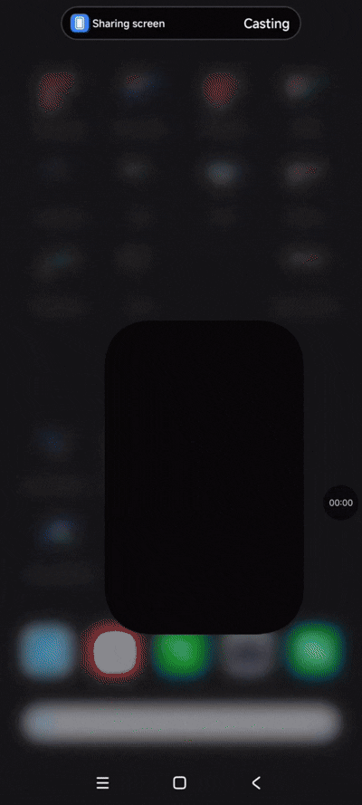
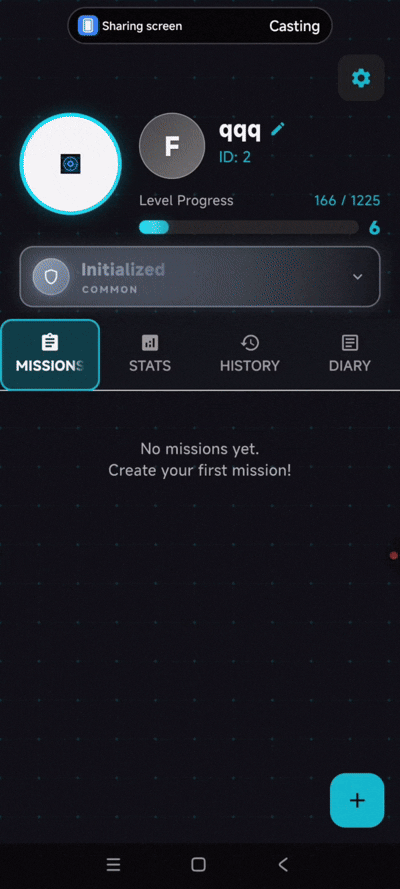
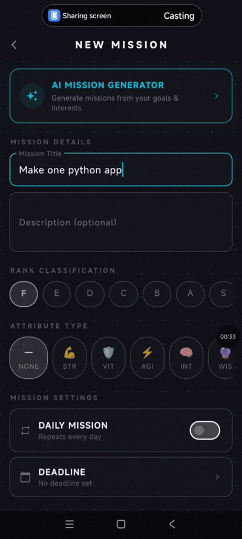
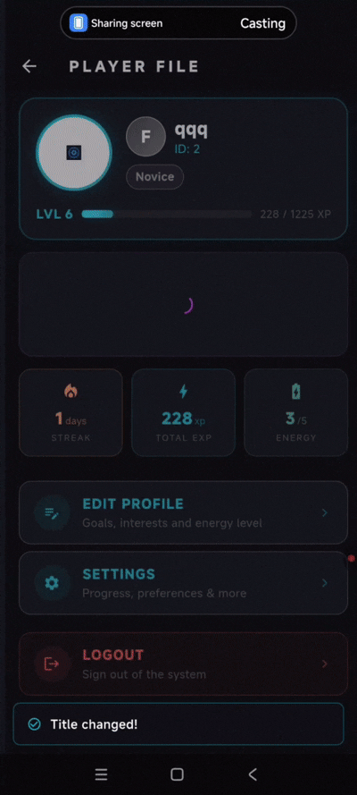

# ⚔️ System

### AI-Powered Gamified Task Manager

**Turn your to-do list into an RPG.** System wraps everyday task management in game mechanics — level up, build your character, and let AI help you decide what to tackle next.

---

## ✨ Overview

**System** is a solo-built Flutter app that blends deep RPG gamification with AI assistance to keep users motivated and making smarter decisions about their work.

Complete tasks to earn XP, level up, grow an attribute tree, and unlock titles and achievements — while AI generates task suggestions and gives personalized feedback on your progress.

---

## 📱 Demo

<table>
  <tr>
    <td align="center"><b>Onboarding & Login</b></td>
    <td align="center"><b>AI Task Creation</b></td>
    <td align="center"><b>AI Task Analysis</b></td>
  </tr>
  <tr>
    <td></td>
    <td></td>
    <td></td>
  </tr>
  <tr>
    <td align="center"><b>Attribute Tree</b></td>
    <td align="center"><b>Achievements & Titles</b></td>
    <td align="center"><b>Diary</b></td>
  </tr>
  <tr>
    <td></td>
    <td></td>
    <td></td>
  </tr>
</table>

---

## 🎮 Key Features

| Feature | Description |
|---|---|
| ⚡ **RPG Gamification** | XP system, leveling, stats, ranks, and titles |
| 🤖 **AI Task Generation** | Smart task suggestions tailored to your goals |
| 🔍 **AI Task Analysis** | Personalized feedback and recommendations |
| 🌳 **Attribute Tree** | Upgrade and specialize your character's stats |
| 📔 **Diary & Progress Tracking** | Log your journey and watch your growth |
| 🏆 **Achievements System** | Meaningful rewards that keep you engaged |
| 🎨 **Modern Flutter UI** | Smooth animations and responsive design |

---

## 🛠️ Tech Stack

**Framework:** Flutter · Dart
**State Management:** Riverpod · Bloc
**AI Integration:** OpenAI · Gemini · DeepSeek
**Architecture:** Clean architecture · REST API

---

## 👤 Author

**Nikita Tarasiuk** (Bobidze)

---

> Personal portfolio project exploring gamification, AI integration, and complex state management in Flutter.
