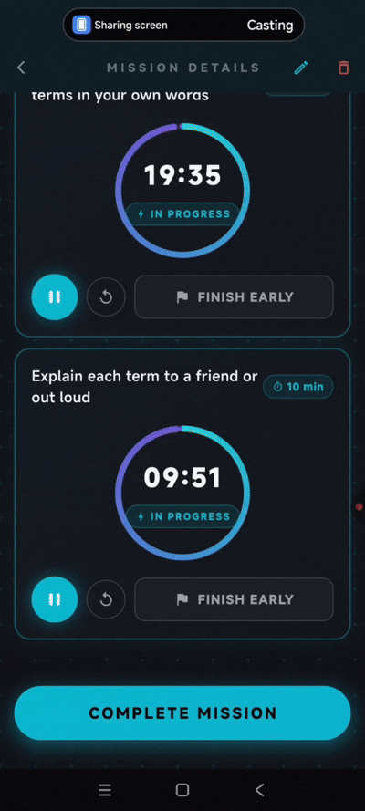
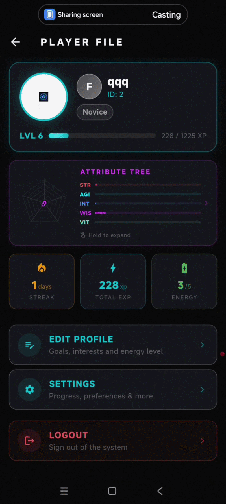
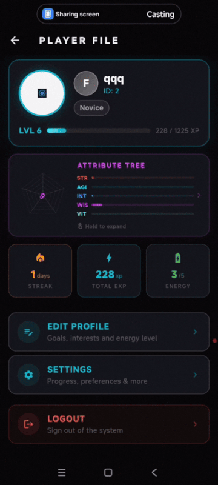

# System

**AI-Powered Gamified Task Manager**

A Flutter mobile application that transforms ordinary task management into an engaging RPG experience with intelligent AI assistance.

## Overview

**System** is a personal productivity app built as a solo project. It combines deep gamification (RPG mechanics) with AI to help users stay motivated and make better decisions about their tasks.

Players level up, build attribute trees, unlock titles and achievements, while AI helps generate and analyze tasks.

## Demo

### Onboarding & Login

### AI Task Creation

### AI Task Analysis

### AI Task Completion

### Diary

### Settings

### Profile

### Achievements & Titles

### Attribute Tree

### Log Out

## Key Features

- **RPG Gamification** — XP system, leveling, stats, ranks and titles
- **AI Task Generation** — Smart task suggestions based on user goals
- **AI Task Analysis** — Personalized feedback and recommendations
- **Attribute Tree** — Upgrade your character attributes
- **Diary & Progress Tracking**
- **Achievements System** with meaningful rewards
- **Modern Flutter UI** with smooth animations

## Tech Stack

- **Flutter** (mobile)
- **Dart**
- **State Management**: Riverpod / Bloc
- **AI Integration**: OpenAI, Gemini, DeepSeek API
- **REST API**
- Clean architecture and responsive design

## Author

**Nikita Tarasiuk** (Bobidze)

- GitHub: [@Bobidze](https://github.com/Bobidze)
- Telegram: @meowuchkin

---

> This is a personal portfolio project built to explore gamification, AI integration and complex state management in Flutter.
